## Part 3: Deploying containers

#### Publishing images on Docker Hub

The easiest way to get your new image onto other computers is by **pushing** your image to your Docker Hub account. First things first, log in to your Docker Hub account via the CLI. Open a terminal in VS Code and run:

`docker login`

Follow the prompts to provide your username and password, and confirm that you see the message `Login Succeeded`.

Next, use the `push` command to publish the image you built in the previous section:

`docker push [DOCKERHUB-USERNAME]/my-textbook`,

replacing `[DOCKERHUB-USERNAME]` appropriately. This will upload the image, including all of the files you copied into it, to Docker Hub. Note that because it will now be publicly available across the web, **you should make sure not to include any sensitive information, like account passwords, in the image itself**. If that kind of data is required, mount the files containing it at run-time or use environment variables.

The CLI will begin the process of uploading your container files to Dockerhub, after which it should display output that looks like the following:

```
Using default tag: latest
The push refers to repository [docker.io/naclomi/my-textbook]
3cc02027512c: Pushed 
39712aead534: Pushed 
1fe39d5d8cc8: Pushed 
321644d0af15: Pushed 
520dcae2068c: Mounted from library/python 
929becff1737: Mounted from library/python 
3652ad81051a: Mounted from library/python 
931a85bd816c: Mounted from library/python 
8764e431c07e: Mounted from library/python 
19ab65c2eea3: Mounted from library/python 
d2fb5ee0c8fd: Mounted from library/python 
7d8e945003fe: Mounted from library/python 
70fd9a3b3b80: Mounted from library/python 
latest: digest: sha256:a736b12cdf30fc6fd7605aacdf8487f189102875048fd5b638d3cffd3253041d size: 3054
```

Your image is now on the web! You can see and alter information about it from your account dashboard at https://hub.docker.com/:


At this point, others can run your image on their computers using the same `docker run` commands we've practiced before:

```
docker run --rm [YOUR-DOCKERHUB-USERNAME]/my-textbook
```

Have a friend try it out on their computer :) .

#### Containers in the cloud

We can run instances of our container image in the cloud, if we need access to more powerful computers or more storage than we have available locally. In this way,  we are thinking of the cloud as a supercomputer that we submit jobs to in the form of Docker container images. 

A classic example might be to develop an ML model training script on your computer over a small subset of the data you have access to, and then deploy it to the cloud in a container where it will train on a beefy computer over the full dataset.

#### Setting up the Azure CLI

There are many ways to run a Docker container in Microsoft Azure. The most general-purpose of which is a service they provide called **Azure Container Instances**. We'll use the **Azure CLI** to interact with it. The Azure CLI runs on the terminal and behaves similarly to the Docker CLI, but its commands all start with `az` rather than `docker`.

Get started by downloading and installing the Azure CLI on your computer here:

[https://docs.microsoft.com/en-us/cli/azure/install-azure-cli](https://docs.microsoft.com/en-us/cli/azure/install-azure-cli)

Once you're finished with that, open a VS Code terminal and logging in to Azure with the command:

`az login`

This command will open a web browser to an Azure login page. Enter your username and password, and once you've successfully logged in go back to the terminal. You should see it list the Azure **subscriptions** you have access to (that is, the billing accounts paying for your cloud resources). In our case, the subscription we want to use is the one for this class, which will have "MSE544" in the title, though in the screenshot below the only one visible is labeled 'Personal'.

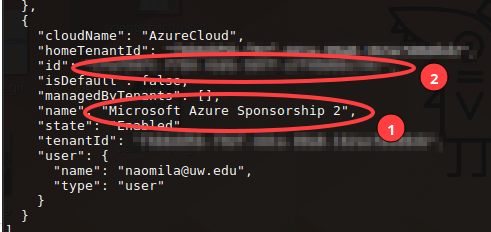

We'll start by setting the CLI to use this subscription by default, so we don't have to specify it for every `az` command we run. Run this command in your terminal, replacing `[SUBSCRIPTION-NAME]` with the complete name of this class's subcription (the one that includes the text `MSE544`):

`az account set --subscription "[SUBSCRIPTION-NAME]"`

Next, we'll tell the CLI what **resource group** to work within. The resource group is specific to you, and is like a cloud "folder" containing all of the Azure services you'll create or use. You can find this information by opening the Azure sidebar in VSCode. Start by clicking the Azure icon (1) and then signing in again (2) .

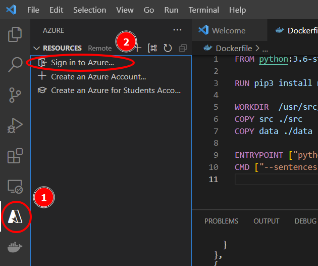

Next, we'll ask the Azure toolbar to show us the resource groups we have access to. Click the tiny `Group By` icon (labelled (1) in the figure below) and select `Group by Resource Group` (2).

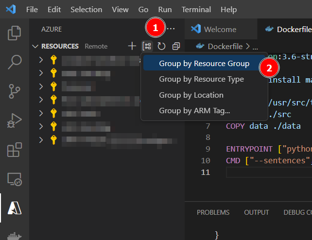

We also need to change some Azure settings for later. Open VS Code's settings page by (1) opening the `File` menu, (2) opening `Preferences` and (3) clicking `Settings`:


Paste `azureResourceGroups.showHiddenTypes` into the search box at the top of the settings page (1), and then check the box on the setting that appears in the subsequent search results (2):


Ok! Finally! In the Azure sidebar on the left, expand the subcription with `MSE544` in the title (1) right-click the resource group created for you (2). Its name will take the form `rg-amlclass-[UW STUDENT ID]`. Select `View Properties` (3):

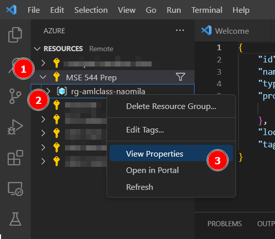

Once you click `View Properties`, a bunch of configuration information should open up in the code editing area. It'll look something like this:

```json
{
    "id": "/subscriptions/ab12345c-def6-7890-gh12-345678i90jkl/resourceGroups/rg-amlclass-naomila",
    "name": "rg-amlclass-naomila",
    "type": "Microsoft.Resources/resourceGroups",
    "properties": {
        "provisioningState": "Succeeded"
    },
    "location": "westus"
}
```

The id of the resource group takes the following form:

`/subscriptions/[SUBSCRIPTION ID]/resourceGroups/[GROUP NAME]`

Note down both the group name and subscription id from the "id" section of the configuration info in your VS code window (don't use the values in the above example). Then, set the resource group with the command:

`az configure --defaults group=[GROUP NAME] `

replacing [GROUP NAME] with the value you just noted down. 

To confirm everything is working, try running the command: 

`az resource list`.

If your CLI is configured properly, this command will return all of the Azure services and objects currently in your resource group (which you can also inspect through that graphical sidebar we've been messing with).


#### Running containers in Azure

To run a container as an Azure Container Instance we'll use the `az container create` command, which is like a cloud version of `docker pull` and `docker run` combined into one command. It'll take the following form:

`az container create --name [INSTANCE NAME] --image [DOCKER IMAGE NAME] --cpu [CORES] --memory [GB RAM] --restart-policy Never --no-wait`

There's a lot going on here. Let's step through it:

* The `[INSTANCE NAME]` is a name you'll use to refer to this container in your cloud account. It can be whatever you want as long as it doesn't have spaces. Let's use something like `my-cloud-textbook`.
* The `[DOCKER IMAGE NAME]` refers to the image you published onto Docker Hub. In the case of this tutorial, that was `[DOCKERHUB USERNAME]/my-textbook`, putting your user name in the appropriate spot.
* The `--cpu [CORES]` flag specifies how many CPU cores we need to run our container. We're not doing much computation for this example, so to save money let's set it to something small like `0.5`. 
* The `--memory [GB RAM]` flag specifies how much RAM we need to run our container. Similarly to the CPU flag, let's use `0.5`. 
* The `--restart-policy Never` flag tells Azure that after our container finishes running, it should just be left in a stopped state. **This is important**, because without it **the container would get re-run in a loop indefinitely**, until we manually stopped it, and this could use up a lot of resources (eg, $$$). The default behavior is useful when a container runs an always-available service like a web server, but for our purposes is really really not what we want.
* The `--no-wait` flag tells the terminal to not hang and wait until the container is set up. Deployment can take a while, since Azure has to find an unused computer in the cloud and download our image to it, so this will let us do other terminal operations while that all is happening.

We'll master all of those options, the more we use Azure. For now, just copy and paste the command with the appropriate values replacing the blanks denoted by `[]`s. It might help to copy it into a text editor first, fill in the `[]`-blanks there, and then copy _that_ to your termainal.

To confirm that your container was created, click the little refresh icon at the top of the Azure sidebar (1) and expand your resource group. You should see the name of your container show up there (2) :

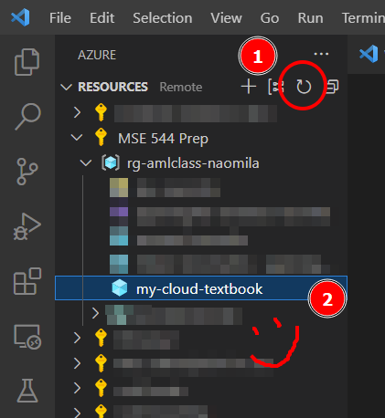

Wait a few minutes, and then try running the command:

`az container logs --name my-cloud-textbook` 

If you named your container instance something else, just replace `my-cloud-textbook` with the appropriate value.

This command will print the output of the container (the stuff that would show up in our terminal automatically after `docker run`, if we were running locally). You should now see some quality garbage:

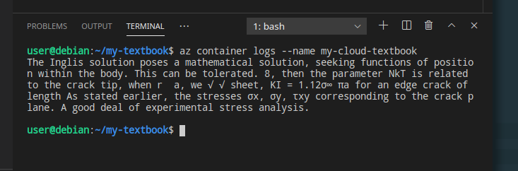

If the command doesn't output anything, or returns an error, try waiting a bit longer for the cloud to finish pulling your image. If it's taking a while, you can see Azure's progress with the command:

`az container show --name my-cloud-textbook`

This outputs a lot of detailed information about the container, including when it started and completed pulling the image from Docker Hub:

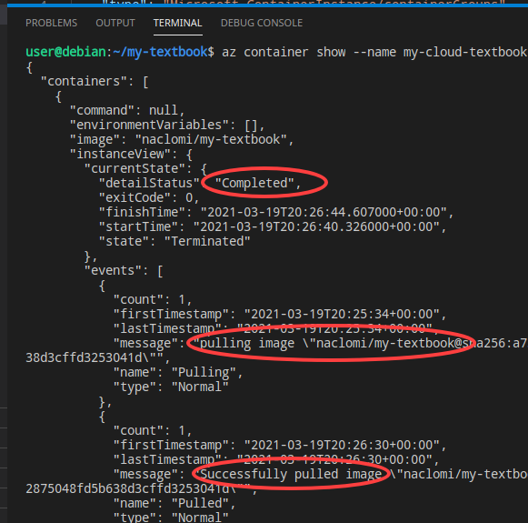


If you _don't_ see this information when running the above command, and you're on a recent Apple laptop, you may need to rebuild your docker container with a few extra options enabled. Run these two commands, with `[YOUR DOCKERHUB USERNAME]` replaced appropriately:

```
docker buildx create --name mybuilder --driver docker-container --bootstrap --use
docker buildx build -t [YOUR DOCKERHUB USERNAME]/my-textbook:latest -f Dockerfile --push --platform=linux/arm64,linux/amd64 .
```

At this point, you can restart the process from the `az container create` step and things should be working.

If `az container create` still fails, giving you an error with the text `InaccessibleImage`, you can just use the reference image built for this tutorial titled `naclomi/textbook-writer-cloudref` (instead of the image you created). This error is related to the added complexity of building Docker containers compatible with Apple computers, and can be circumvented with some further tricks that are unfortunately outside the scope of what we have time for here.

Regardless of the above, once you're done, delete the container with the command:

`az container delete --name my-cloud-textbook`

**Make sure to delete the container once you're done here**, to make sure you don't leave resources in the cloud that may use up funds.

#### Using cloud file stores for Azure container input/output

To get files in and out of a container running in Azure, we can mount Azure file stores similarly to how we mount folders when we use `docker run` locally. Let's get some practice with this by using the `naclomi/textbook-writer` image to generate a PDF in the cloud.

Let's start by creating a file store for the container output. It's a little convoluted, but Azure file stores exist within an administration hierarchy that looks like this:

`Subscription (eg, billing) -> Resource Group -> Storage Account -> File Share -> Your files  `

Yikes, right? Anyway, we need to create a new storage account, and then within that create a file share. Then, when we start our Docker container, we can point it towards that file share and it put stuff in it.

Start by opening the Azure sidebar in VS Code, clicking the + button at the top (1), and typing "Storage Account" into the box that pops up to create a new storage account (2):

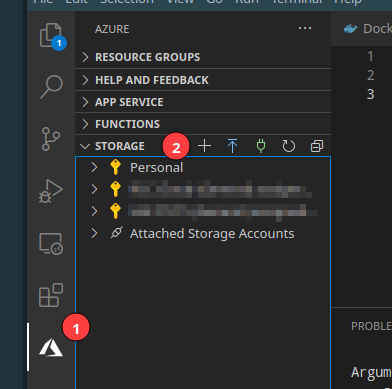

VS Code will then ask you for a few details:

- What subscription to create the account within. Select the subscription for this class.
- A unique name for the account This name can only contain letters and numbers, and has to be unique across all of Azure (how dramatic!). You can choose whatever you want, but to make it easier to find a name that isn't taken it helps to prefix it with your own username.
- A location to put the storage in. It doesn't ultimately matter, but for now select `Central US`.

VS Code _may_ complain that you don't have permission to create a resource group. This is fine, just click 'Select existing' and then choose your class-created resource group from the list that pops up (the one that has your username in it):


After all of this this, VS Code will spin a bit waiting for Azure to finish creating your storage account. Once it's done, you'll see a little green checkbox in the status window at the bottom of your screen:


In the Azure sidebar, refresh the list of resources (1), expand the new storage account you just created (2), right-click `File Shares`, and select `Create File Share...` (3):

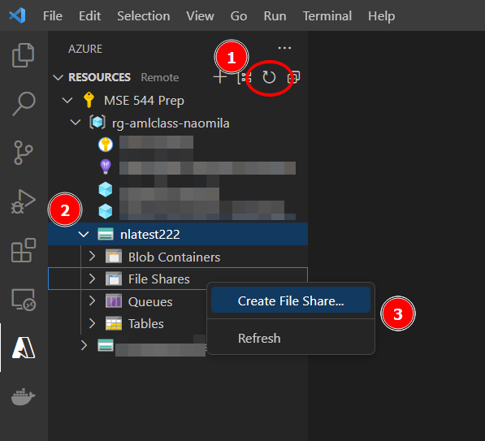

VS Code will then ask for:

- A name for the file share. This one doesn't have to be unique across Azure, and can contain dashes. Name it something simple and informative, like `dockeroutput` .
- The max size of the share, in GB. Specify the minimum, `1`. We won't be needing much for this example.

If all goes well, you should see the share appear in the storage explorer:

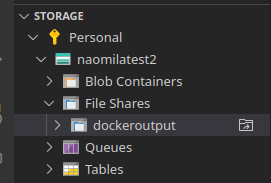

Now we're ready to run a container that connects to it.

We connect the file share when we run the `az container create` command. We'll need to add a few extra flags:

- `--azure-file-volume-account-name [NAME]` 
  The name of the storage account we created

- `--azure-file-volume-account-key [KEY]`
  The key of the storage account. Think of this as like an auto-generated password. You can get the key by right-clicking the storage account in the sidebar and selecting `Copy Primary Key`, which will put it in your clipboard. You can then paste it into a text editor.

  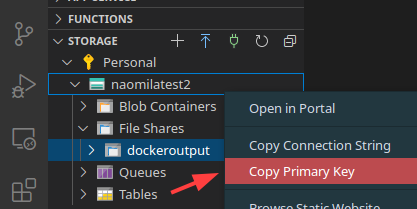

- `--azure-file-volume-share-name [NAME]` 
  The name of the file share *within* the storage account we created

- `--azure-file-volume-mount-path [CONTAINER PATH]`
  The path inside of the container to mount the share to. This is like the second half of the `-v [LOCAL PATH]:[CONTAINER PATH]` flag that you pass to `docker run` when mounting a folder on your computer.

In addition to the above flags that mount a file share to our container, we also need to tell the container to generate a PDF. Unlike the Docker CLI, Azure doesn't let us add extra flags when we run the container, it only lets us replace the entrypoint entirely:

- `--command-line "[COMMAND HERE]"`
  This flag will replace the container entrypoint with whatever you specify in double-quotes. This is the equivalent of `--entrypoint` when using `docker run`.

We'll mount the file share to the location `/output` in our container, and then save a file there called `text.pdf` by using then entrypoint "`python3 src/main.py --pdf /output/text.pdf`".

Copy and execute the command line below, replacing the `[ ]`-indicated blanks with their appropriate values. It's probably a good idea to first copy this content into a blank text file, replace the `[ ]`-blanks, and then copy _that_ into your terminal.

If you're on MacOS, Linux, or WSL, the command looks like:

```
az container create \
   --name my-cloud-textbook \
   --image naclomi/textbook-writer \
   --cpu 0.5 --memory 0.5 \
   --restart-policy Never --no-wait \
   --command-line "python3 src/main.py --pdf /output/text.pdf" \
   --azure-file-volume-account-name [STORAGE ACCOUNT NAME] \
   --azure-file-volume-account-key [STORAGE ACCOUNT KEY] \
   --azure-file-volume-share-name [FILE SHARE NAME] \
   --azure-file-volume-mount-path output 
```

If you're on Windows PowerShell (your command line starts with the letters "PS"), the command looks the same as above but with backticks at the end of the line instead of slashes:


```
az container create `
   --name my-cloud-textbook `
   --image naclomi/textbook-writer `
   --cpu 0.5 --memory 0.5 `
   --restart-policy Never --no-wait `
   --command-line "python3 src/main.py --pdf /output/text.pdf" `
   --azure-file-volume-account-name [STORAGE ACCOUNT NAME] `
   --azure-file-volume-account-key [STORAGE ACCOUNT KEY] `
   --azure-file-volume-share-name [FILE SHARE NAME] `
   --azure-file-volume-mount-path output 
```

Oof, it's complicated, but it's powerful. Good job command line warrior. Run it, and then wait a minute or two for Azure to complete its work. As before, you can check the status of the container with the command:

`az container show --name my-cloud-textbook`

Once it's all done, click the refresh icon in the Azure bar (1), and expand the file share by clicking the arrow next to it (2). You should see our pdf sitting there! Right click it, and select `Download` (3):

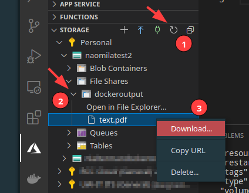

VS Code will ask you where to save the file to. Select your project folder from the list (or browse for whatever other location you like), then open it up in your computer's file explorer.

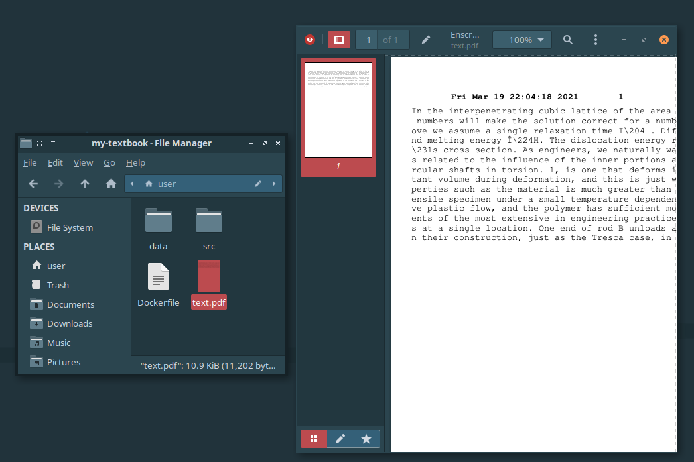

Congratulations -- this was a lot of steps for some pretty advanced computing, and you did it!

Now that the file share is created, you can rerun the container with `az container start` or create new ones that connect to the share with `az container create` as much as you like. The steps preceding the `az container create` command only have to be done once.

Remember to delete all of the resources you used from Azure once you're done, using the `az container delete` command for the containers and by right-clicking the storage account and selecting `Delete Storage Account...`.
