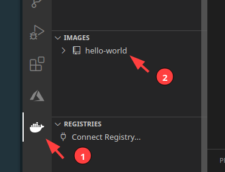
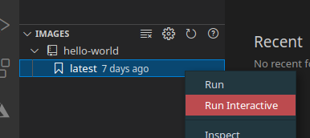
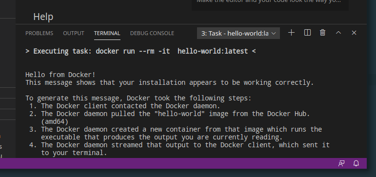
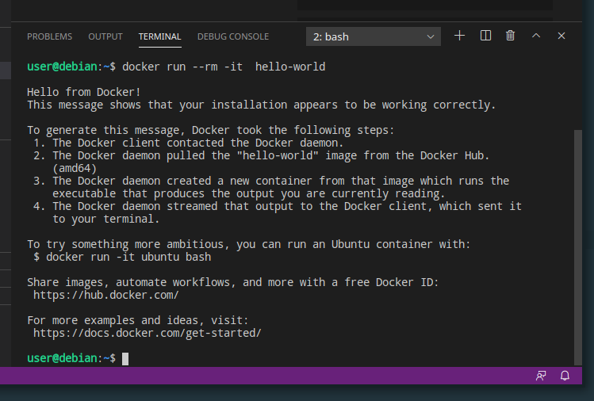
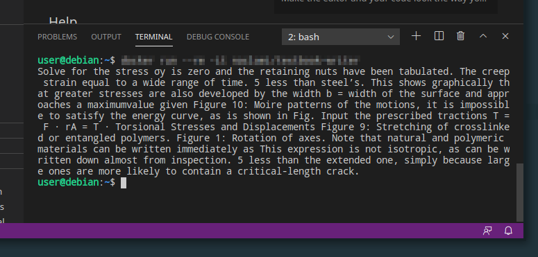
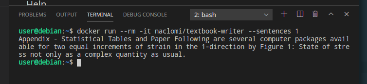
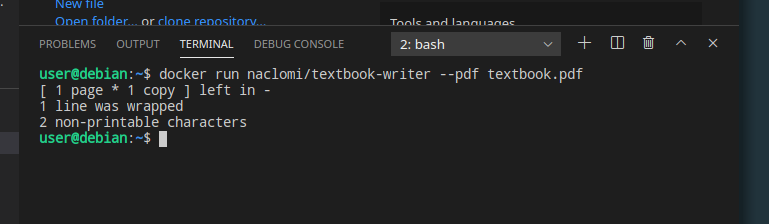
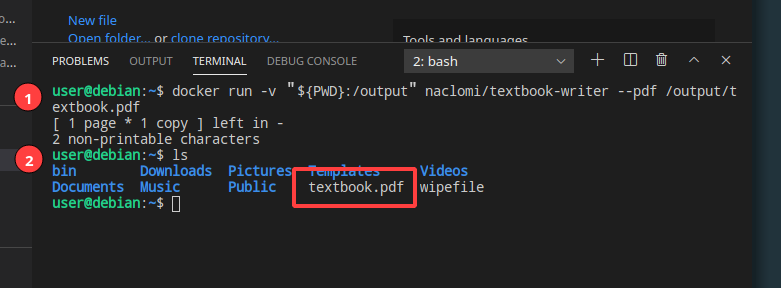
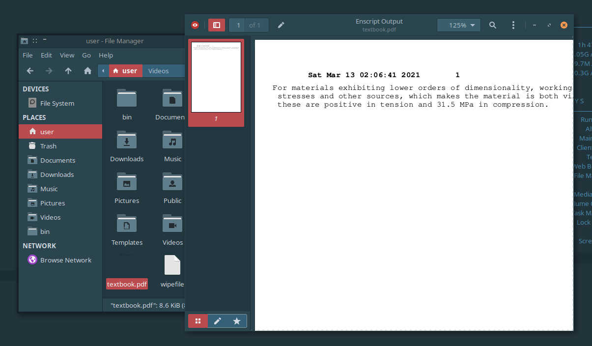

# Containerization Tutorial

## What are we doing here?

#### Tutorial Goals

In this tutorial we are going to learn how to:

- Download and run applications packaged within Docker containers
- Build our own Docker containers from scratch
- Deploy our Docker containers to Azure

#### Requirements and expectations

TODO:

VSCode, Docker, Python, Azure account

## Background

#### Containers

**Containers** are a technology that let you easily reproduce the environment your code runs in on other computers and servers. This environment includes all the software, libraries, and hand-tweaked configuration you need to run your experiments and reproduce their results.

You could think of containers as very **light-weight** virtual machines: they run faster and take up less disk space than traditional VMs, while still giving the appearance of an isolated computer to the applications running within.

That said, they are more often used to **run code** than as an **interactive desktop computer** -- you won't usually open a terminal within a container or run graphical applications from them. Rather, once you develop your code, you will **package it** into a **container image** which can be **run reproducibly**.

#### Docker

**Docker** containers are one implementation of the container concept, which we will be working with for the remainder of this tutorial. Docker container images can be **published** for free on **Docker Hub**, which hosts Docker images the same way Github hosts code and Google Docs hosts word documents.

The most common way of interacting with Docker on your computer is with the Docker Command Line Interface (**Docker CLI**), but there is also a wonderful **VS Code Docker plugin** that lets us do many of the same operations through VS Code's GUI. We will be using that as well.

## 1. Installing Docker

Installing Docker can be an unfortunately involved process depending on what operating system 

- https://carpentries-incubator.github.io/docker-introduction/setup.html

After you have Docker installed, sign up for an account on Docker Hub:

https://hub.docker.com/

## 2. Running containers

##### Pulling our first image

First things first, let's open a **terminal** in VS Code that we'll issue Docker CLI commands from.

Select `Terminal -> New Terminal`


Now, in the terminal that pops up in the bottom of our VS Code window, enter the following command:

`docker pull hello-world`


The **pull** command has the syntax `docker pull [IMAGE NAME]` and downloads the specified image hosted on Docker Hub to your computer. In this case, we're pulling a very simple container image that will print a Hello World message to our terminal when we run it.

We should now see `hello-world` in the list of docker images installed on our system. We can see all of the images we have installed by clicking the Docker icon on the left-side of the VS Code window (1) and then inspecting the list in the `IMAGES` accordion box. See how the image we just pulled appears there (2):



If we click the arrow to the left of the image name to expand it, we'll see a **version list**. If we download multiple versions of the container (like multiple editions of a book), they will all be listed here, but for now we only have the **latest** version:


##### Images vs. Containers

TODO

##### Running our first container, through VS Code

Anyway, now that we've downloaded `hello-world`, let's run it. One way to do so is by right-clicking an image version in the `IMAGES` list  and selecting `Run interactive`:



We'll see the results of the run appear in the terminal part of the window:



Congratulations, you just ran your first container!

**So, what just happened?**

If containers are like little VMs, what happened to this one? Does it still exist? How did it print this text? Is it bored? Is it lonely?

When we **run** a container, the contents of the image are copied from disk into memory, and then the container's **entrypoint** is executed. The entrypoint is a terminal command, just like the ones we enter into the VS Code terminal. The only difference is that the command is executed from within the virtual world of the container, and it's specified ahead of time when the image was built. In this case, the entrypoint was a command that printed the "Hello from Docker!" message we see above.

After the entrypoint command completes, the container is **shut down** and its memory is freed. This means that all of the **changes to container files get wiped**; every time we run the container, it starts again from same the pristine state the image specifies.

##### Running our first container, through the CLI

Notice that when we ran the container, the output started with the message: 

`> Executing task: docker run --rm -it  hello-world:latest <`

This is actually displaying the CLI command that we could enter into the terminal to run the container. It's really nice that the graphical interface tells us its equivalent CLI commands like this!

The docker **run** command takes this form:

`docker run [flags] [image name]:[image version] `

As we saw earlier, the image name is `hello-world`, and the version we downloaded was `latest` (this is the default version name, and if we didn't specify a version `latest` would be implied).

The `--rm` flag tells docker to delete the leftover contents of the container once it finishes running. Note that this doesn't delete the image -- it deletes the container we just ran, which was reconstituted from the image.

The `-it` flags tell docker to run the container interactively -- that is, use the terminal to print output and take input from us. Omitting this flag would run the container in the background without giving us an opportunity to prod it from the terminal. This is useful for containers that run web servers or train machine learning models, applications that might take a long time and not need user interactivity (at least, not interactivity through the terminal)

Let's try running the container again through the terminal. As the message says, press any key in the terminal to return to an interactive prompt. Now run the command:

`docker run --rm -it  hello-world`

We should see the same output as before:



Using the GUI to run containers is fast and easy, but using the CLI will give us some much-needed flexibility later on.

##### Trying out a more interesting container

Now that we've gotten our sea legs, let's try running a container that does something more interesting. The `naclomi/textbook-writer` image contains a python script that uses rudimentary AI techniques to write machine-generated nonsense paragraphs for a materials science textbook. Here's a link to the container's page on Docker Hub:

https://hub.docker.com/r/naclomi/textbook-writer

**EXERCISE: **Use the commands we explored above to pull the image and then run it interactively. If you need reminders of the commands you've previously run, try using the **up and down arrow keys** at the terminal prompt to scroll through your command history.

Once you do so successfully, you should see some scientific-sounding garbage text printed to the console, looking something like this:



##### Exploring the internals

Let's next explore the virtual world of the textbook-writer's container, to get a sense of how it works. To do this we will explicitly change the entrypoint of the container from `main.py` (the textbook generation script) to `bash` (the **shell** program that lets us enter terminal commands). This deviates from the default usage pattern designed by author of the container image; we're effectively using a master key to climb into the container as the root user for a look around. The author will probably forgive us our curiosity ;) .

We can open a bash shell inside the container with the following command:

`docker run --rm -it --entrypoint bash naclomi/textbook-writer`


Notice how the prompt has changed: we are now in a terminal within the container's virtual world, where our username is `root`, and the computer's name is `bda407f49990` (or some other arbitrary-looking name), and the current directory is `/usr/src/textbook-writer`. 

Let's take a look around. Run the `tree` command print the files within the current directory:


Cool! We can see here that the non-gibberish real textbook that the machine-generated passages are based on is in the `data/` directory, and the entrypoint script is at `src/main.py`. Let's try running it from here:

`python3 src/main.py`


And now let's look at the source code, by using the `cat` command to print the file to the terminal:

`cat src/main.py`


Neato. We can see that the script uses the library [markovify](https://pypi.org/project/markovify/) to generate random text, but because the docker container comes packaged with it (and with Python 3.6), we didn't need to manually install it on our computer to run the code!

To exit the virtual terminal, run the command `exit` or use the keyboard shortcut `Ctrl+D`

##### Entrypoint flags

If in the container we ran `python3 src/main.py -h`, we'd see that the python script takes some command line arguments of its own:

```
usage: main.py [-h] [--sentences N] [--pdf FILENAME]

optional arguments:
  -h, --help      show this help message and exit
  --sentences N   how many sentences to output
  --pdf FILENAME  output as a pdf file
```

Since `main.py` is the contianer's entrypoint, any flags we put in our `docker run` command following the image name will be passed to it.  Let's try playing with them. From the terminal:

`docker run --rm -it naclomi/textbook-writer --sentences 1  `



We can use the `--pdf` flag to output the text as a pdf file, rather than terminal text:

`docker run naclomi/textbook-writer --pdf textbook.pdf`



...but, how do we get the file *out* of the container?

##### File mounts

By default, when a container finishes running all of the files generated or modified during its run are lost. However, we can **mount a directory** from our computer into the container's file system, inside of which any files created or modified will **persist** after the container shuts down.

Think of a file mount like a backpack: you can bring all of your study materials to the library, unpack them onto a table, and then do work. When you leave, you put everything back in your bag to carry out of the library, while at night anything you left on the table will get thrown out by the custodial staff.

To mount a directory to a container, we specify the mount point as a flag in our `docker run` command. The flag takes this form:

`-v [host_path]:[container_path]` 

where `[host_path]` is the directory on your computer to mount, and `[container_path]` is the place inside the container it will show up. 

For our textbook writer, we can mount the current directory the terminal is sitting in to the container path `/output` with this command line (1):

`docker run -v "${PWD}":/output naclomi/textbook-writer --pdf /output/textbook.pdf` 



Then, if we look at the contents of the current directory (2), we'll see that the container saved the pdf to our working directory :D ! Let's open it up!

Still just as incomprehensible as ever ;) .

## 2. Building containers

Running docker containers in itself is a useful skill and you can do a lot with the pre-existing containers published on Docker Hub, but to fully customize the contents of a container you'll need to build your own images. In this section we'll walk through how.

##### Building our first image

Images are defined through a **Dockerfile**, a little script that instructs Docker which files to copy into the container and what the entrypoint command is to be executed once the container is eventually run. Once we write our Dockerfile, we'll issue a terminal command that reads it in and actually builds the container image. Once *that's* done, we'll be able to run the container like we did in the previous section.

To get started, create a folder somewhere on your computer called `hello-world`. We'll be storing source code for our container image there. Next, open it in VSCode through the Explorer sidebar tab's "Open Folder" button:


If you already had a folder or project open, you may need to close it by navigating to `File menu -> Close Folder`.

Once you've opened the `hello-world` folder, create a new file (`File menu -> New File` or `Ctrl+N`) and fill it with the following contents:

```dockerfile
# My first Dockerfile
FROM python:3.6-stretch

ENTRYPOINT echo Hello World
```

Save the file with `File menu -> Save` or `Ctrl+S` and name it `Dockerfile`. At this point, you should see the text become **syntax highlighted** and the file appear in the Explorer sidebar on the left:


Now open a terminal (`Terminal menu -> New Terminal`) and run the command:

`docker build -t [DOCKERHUB-USERNAME]/hello-world .`

replacing `[DOCKERHUB-USERNAME]` with the username you used to sign up for Dockerhub.

The first time you run this command might take a few minutes to download all of the files required to build the container (it'll go faster next time!). Once it's done you should see output that ends with a message like this:

```
Successfully built 7856838c829b
Successfully tagged naclomi/hello-world:latest
```

Now, we can run our container either from the Docker sidebar or with the following terminal command:

```
docker run --rm [DOCKERHUB-USERNAME]/hello-world 
```


You did it! You just built your first container image! So....what exactly did you just do? Let's start by walking through the dockerfile code you wrote.

##### Dockerfile Syntax

A dockerfile consists of a series of commands, one per line. Comments start with a `#`, after which the rest of the line is ignored (just like Python). 

Our first command was **FROM**:

- `FROM [image-name]`
  This bases our new image off the **base image** specified by `[image-name]`, on top of which our changes get layered like new layers of paint on a painting. That name might refer to an image you already have on your computer, or possibly an image published on Docker Hub. Either way, all dockerfiles must start with a FROM command.

  In this case our base image was `python:3.6-stretch`, a container that already comes with Linux and Python 3.6 pre-installed. If we wanted to base an image off the latest version of Ubuntu Linux, it might look something like this: `FROM ubuntu:latest`.

Then, we issued an **ENTRYPOINT** command:

- `ENTRYPOINT [terminal-command]`
  This sets what command will be executed when the container image is actually run with `docker run`. Only the last ENTRYPOINT command in the Dockerfile will actually take effect, while the rest will be ignored.

  In this case, we issue the command `echo Hello World`, which prints "Hello World" to the terminal. Any command you normally type into the terminal could be put here, though keep in mind that command will only have access to what your Dockerfile copies into the container. TODO: exercise trying to access host-side files

##### The `build` command and image tags

To build a container, we run the `docker build` command which takes the form:

`docker build -t [image-name] [project-directory]`

The `-t [image-name]` flag specifies what we want to call, or **tag**, the image. We can actually specify as many tags as we like, by repeating the `-t [image-name]` flag with new names. By convention, names take the form:

`[user-name]/[image-name]:[image-version]`

where `[user-name]` is your Dockerhub username, `image-name` is what you'd like to call the image, and `[image-version]` is a version number like `1.0` or `latest` (the default version). If you leave out the `:[image-version]` section of the name, Docker will just assume the version is `latest`.

Finally, `[project-directory]` specifies the folder on your computer that contains the `Dockerfile` you would like to compile. In this case, since our terminal was already in the project directory, we just specified "the current location" with `.` .

##### Build-time versus run-time

Let's add a new command to our Dockerfile:

```dockerfile
# My first Dockerfile
FROM python:3.6-stretch

# New command:
RUN echo Hello Galaxy

ENTRYPOINT echo Hello World

```

Save the file and re-run the `docker build` command from the previous exercise (recall you can use the up arrow key in the terminal to retrieve previous terminal commands you've run). In general, you need to run `docker build` every time you modify the Dockerfile for your changes to actually take effect.

Once it's built, re-run the container with `docker run`.

Let's look at the output for all of this:

```
user@debian:~/hello-world$ docker build -t naclomi/hello-world .
Sending build context to Docker daemon  2.048kB
Step 1/3 : FROM python:3.6-stretch
 ---> d8e3ac20e6dd
Step 2/3 : RUN echo Hello Galaxy
 ---> Running in 83cf57ff4447
Hello Galaxy
Removing intermediate container 83cf57ff4447
 ---> c1c2c5086c1f
Step 3/3 : ENTRYPOINT echo Hello World
 ---> Running in b6fb35bc5148
Removing intermediate container b6fb35bc5148
 ---> 26a6f4c65850
Successfully built 26a6f4c65850
Successfully tagged naclomi/hello-world:latest
user@debian:~/hello-world$ docker run naclomi/hello-world 
Hello World
user@debian:~/hello-world$ 
```


Gosh! Let's call attention to the place where our two `echo` messages showed up. The `echo` issued by the `RUN` command happened when we ran `docker build`, while the `echo` issued by `ENTRYPOINT` happened when we ran `docker run`.

This is a really important concept:

**RUN commands happen at "build time", while the ENTRYPOINT command happens at "run time"**

In practice, this means the `RUN` commands only happen once when you build the container image, and then the `ENTRYPOINT` will happen every time any user out there in the wide world runs the image. This division of build time and run time is useful because it allows us to issue terminal commands that install software once at build time, and then never have to worry about them again.

Taking a step back, the best way to think about a Docker container might be as a fish tank: 

*(Photo by [Sarah Brown](https://unsplash.com/@sweetpagesco?utm_source=unsplash&utm_medium=referral&utm_content=creditCopyText) on Unsplash)*

The Dockerfile is the instruction manual telling you how to assemble the tank. At build-time, you follow the instructions to pour rocks into the bottom of the tank and set up all of the tank's decorations. Then, at run time, you fill the tank with water and introduce the fish. The `RUN` commands specify how and where to put the tank decorations. The `ENTRYPOINT` command specifies what fish we will eventually put in the tank. The `docker run` terminal command actually pours the water and introduces the fish.

##### Building a container with files

Let's start work on our textbook-writer image. Create a new folder on your computer somewhere other than within `hello-world`. Call the new folder `my-textbook`. Open it in VS Code, create a new file, and save it in the directory as `Dockerfile`. 

10. Copy our source in, change entrypoint:

    ```dockerfile
    TODO
    ```

11. Build & run. Note dependency failure.

12. Add line to pip install markovify 

    ```dockerfile
    TODO
    ```

13. *Now* build & run :) 

14. But PDF still doesn't work?!

15. Apt install line:

    ```dockerfile
    TODO
    ```

16. Build & run :) 

## 3. Deploying containers

17. `docker push [DOCKERHUB-USERNAME]/my-first-container`
18. Azure portal -> Services -> Container Instances (https://portal.azure.com/#blade/HubsExtension/BrowseResource/resourceType/Microsoft.ContainerInstance%2FcontainerGroups)
    1. Add
    2. Choose your resource group
    3. Choose a name
    4. Image source: "Docker Hub or other registry"
    5. Image: Enter your container name
    6. Change size to 0.5 GiB memory (we don't need much for this)
    7. Review & Create -> Create
    8. Wait for it to deploy, then "Go To Resource"
    9. Containers -> Logs
19. There are many ways on Azure to deploy a container. See also: app service
20. TODO: yikes there is no way to mount a volume using a GUI
    https://docs.microsoft.com/en-us/azure/container-instances/container-instances-volume-azure-files

## Notes and References

Some content adapted from The Carpentries' [Docker lesson](https://carpentries-incubator.github.io/docker-introduction/), retrieved on Mar 10, 2021


TODO: unused text--

If an image with the name you specify in the build command already exists on your computer, rather than getting overwritten or deleted it continues to exist on your computer with a gibberish name: